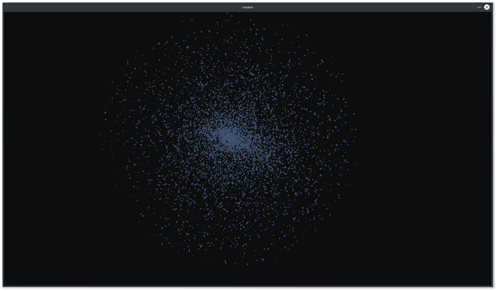

# MopViewer
MopViewer is a project I took on for my 3rd Year University Project. MopViewer
is a visualisation tool to display the data generated by moody.

Moody can be used to calculate gravitational forces on objects in space and
outputs the result to .mop files.

MopViewer can load these .mop files allowing you to explore the simulated scenes
in space.

The main interface is made in nCurses which displays the data from the file.
The main viewer is made from OpenGL and allows full 3-dimensional movement.

This project is still in it's very early stages and only implements the basics
for displaying the files.

_This shows a MopFile with 10,000 particles forming a Globular Cluster_

_This shows a MopFile with 100,000 particles_


## Current Features/Usage:
1. Enter _1_ to look at Particle information
2. Enter _2_ to Open Mopviewer
3. Enter any other key on main screen to exit
4. Use _Up_ and _Down_ Arrow Keys to increase or decrease the amount of particles
to load
5. Use _Left_ and _Right_ Arrow Keys scale up or down the distances between particles

## Particle Information Screen:
1. Use the _Left_ and _Right_ Arrow Keys to cycle between particles
2. Use _2_ to exit program to main menu
3. Use _Up_ Arrow to cycle through states
4. Use _Down_ Arrow to reset to original state

## Installation
Only been tested on Ubuntu at the moment. Should be compatible with cygwin
### Required Libraries
1. OpenGL 3.3 or higher compatible GPU/drivers
2. [GLFW](http://www.glfw.org/)
3. [GLEW](http://glew.sourceforge.net/)
4. nCurses _(libncurses-dev)_
5. [glm](http://glm.g-truc.net/0.9.7/index.html)
6. [STB](https://github.com/nothings/stb) for image loading
7. [Assimp](https://github.com/assimp/assimp) for model loading (Use newer version off of github or it won't compile)
8. Not a library but there is some c++11 features in use

Currently uses a Makefile to compile so make is required

Download the latest [release](https://github.com/Afrostie/Mopviewer/releases/tag/1.2), unpack it and run make

## MopFile's
1. MopFiles should be placed in the Resources Folder
2. When asked for the File Name it automatically adds the file location and the extension.
3. E.G to use the 10000 particles file simply enter 10000 when prompted
4. MopFiles too large for github can be downloaded from [here](https://www.dropbox.com/sh/9mq6s7wrj2i3udk/AABcujcJOI9ZtQ-YM0H6_1sRa?dl=0)

## Modification's
This project is in it's very early stages and the code is extremely messy and latest version will often be unstable. Most of the important part happens in [mopViewer/viewer/gameWindow.cpp](mopViewer/viewer/gameWindow.cpp)

If you want to check the screen size currently you need to modify these values:
```c++
GLint WIDTH = 1920;
GLint HEIGHT = 1080;
```

To change model used for particles modify:
```c++
Model newModel("Resources/Model/sphere/sphere.obj");
```

For loading large files it can be useful to see how many particles are loaded. In this case uncomment this line found in [mopLoader/mopfile/MopFileLight/MopFile.h](mopLoader/mopfile/MopFileLight/MopFile.h)
```c++
std::cout << "Loaded Object: " << x << " Out of: " << numParticles << std::endl;
```

# TODO:
1. Improve loading times for large particle counts. Can be upwards of 5 minutes for 100,000 particles
2. Use instanced rendering to improve performance for large amounts of particles
3. Make improvements to skipping to allow for finer control over the amount of particles loading
3. Add optional debug mode that will enable/disable output to the console
4. Add more features!
