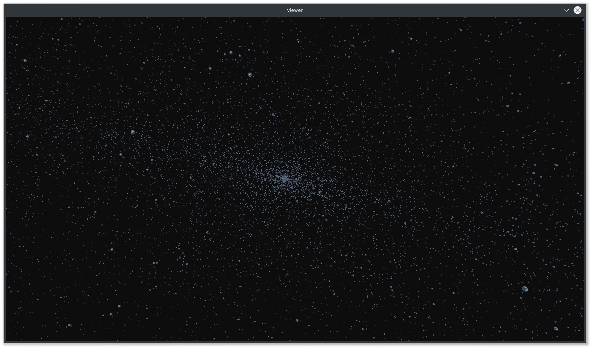

mopViewer 
=====================================================================================

mopViewer is a project I took on for my 3rd Year University Project. mopViewer is a visualisation tool to display the data generated by [Sulaco](https://gitlab.com/carey.pridgeon/sulaco) (Previously known as moody).

Sulaco is a parallel n-body modelling framework for use in moderatelly large modelling scenarios of several thousand particles. The results are recorded in .mop files.

mopViewer can load these .mop files allowing you to explore the simulated scenes in space.

The main interface is made in nCurses which displays the data from the file. The main viewer is made from OpenGL and allows full 3-dimensional movement.

This project is still in it's very early stages and only implements the basics for displaying the files.

*This shows a MopFile with 10,000 particles forming a Globular Cluster* *This shows a MopFile with 100,000 particles* 

Current Features/Usage:
-----------------------

1.	Enter *1* to look at Particle information
2.	Enter *2* to Open mopViewer
3.	Enter any other key on main screen to exit
4.	Use *Up* and *Down* Arrow Keys to increase or decrease the amount of particles to load
5.	Use *Left* and *Right* Arrow Keys scale up or down the distances between particles

Particle Information Screen:
----------------------------

1.	Use the *Left* and *Right* Arrow Keys to cycle between particles
2.	Use *2* to exit program to main menu
3.	Use *Up* Arrow to cycle through states
4.	Use *Down* Arrow to reset to original state

Installation
------------

Only been tested on Ubuntu at the moment. Should be compatible with cygwin

### Basic Steps:

Install libraries

```shell
git clone https://github.com/afrostie/mopViewer.git (or your own fork)
cd mopViewer/
git submodule init
git submodule update
make
./mopViewer
```

Alternativly using recursive can shorten the Steps.

```shell
git clone https://github.com/afrostie/mopViewer.git --recursive

```

### Required Libraries

1.	OpenGL 3.3 or higher compatible GPU/drivers
2.	[GLFW](http://www.glfw.org/)
3.	[GLEW](http://glew.sourceforge.net/)
4.	nCurses *(libncurses-dev)*
5.	[glm](http://glm.g-truc.net/0.9.7/index.html)
6.	[STB](https://github.com/nothings/stb) for image loading
7.	[Assimp](https://github.com/assimp/assimp) for model loading (Use newer version off of github or it won't compile)
8.	Not a library but there is some c++11 features in use

#### Important Note

The loading of .mop files has been moved to a seperate repository as it is code shared between mopViewer and Sulaco. It can be found here [Mopfile](http://gitlab.com/carey.pridgeon/Mopfile)

Mopfile is included as a submodule in mopViewer, however when you clone it does not include the extra files so you must run (unless you use recursive)

```bash
git submodule init
git submodule update
git pull origin master
```

Currently uses a Makefile to compile so make is required

Download the latest [release](https://github.com/Afrostie/mopViewer/releases/tag/1.2), unpack it and run make

MopFile's
---------

1.	MopFiles should be placed in the Resources Folder
2.	When asked for the File Name it automatically adds the file location and the extension.
3.	E.G to use the 10000 particles file simply enter 10000 when prompted
4.	MopFiles too large for github can be downloaded from [here](https://www.dropbox.com/sh/9mq6s7wrj2i3udk/AABcujcJOI9ZtQ-YM0H6_1sRa?dl=0)

Modification's
--------------

This project is in it's very early stages and the code is extremely messy and latest version will often be unstable. Most of the important part happens in [mainApplication/Viewer/gameWindow.cpp](mainApplication/Viewer/gameWindow.cpp)

If you want to check the screen size currently you need to modify these values:

```c++
GLint WIDTH = 1920;
GLint HEIGHT = 1080;
```

To change model used for particles modify:

```c++
Model newModel("Resources/Model/sphere/sphere.obj");
```

For loading large files it can be useful to see how many particles are loaded. In this case uncomment this line found in [Mopfile/MopFile.h](Mopfile/MopFile.h)

```c++
std::cout << "Loaded Object: " << x << " Out of: " << numParticles << std::endl;
```

TODO:
=====

1.	Improve loading times for large particle counts. Can be upwards of 5 minutes for 100,000 particles
2.	Use instanced rendering to improve performance for large amounts of particles
3.	Make improvements to skipping to allow for finer control over the amount of particles loading
4.	Add optional debug mode that will enable/disable output to the console
5.	Add more features!
